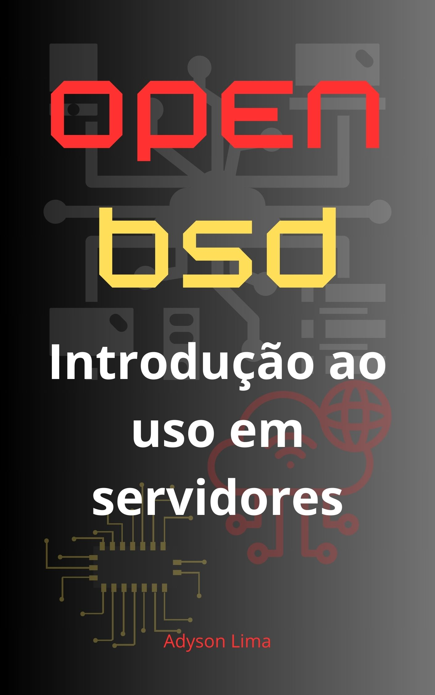

# 'OPEN BSD introdução ao uso em servidores', é um tutorial para interessados em conhecer sistemas OpenBSD, com foco em servidores.

##Pré-requisitos:
- Conhecimentos em servidores Linux.
- Conhecimentos em VirtualBox.
### <a href="">Baixe aqui o PDF :)</a>
